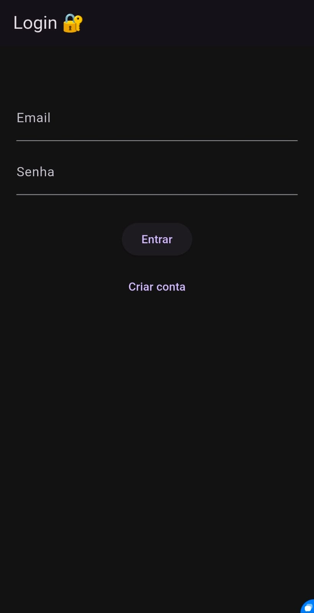
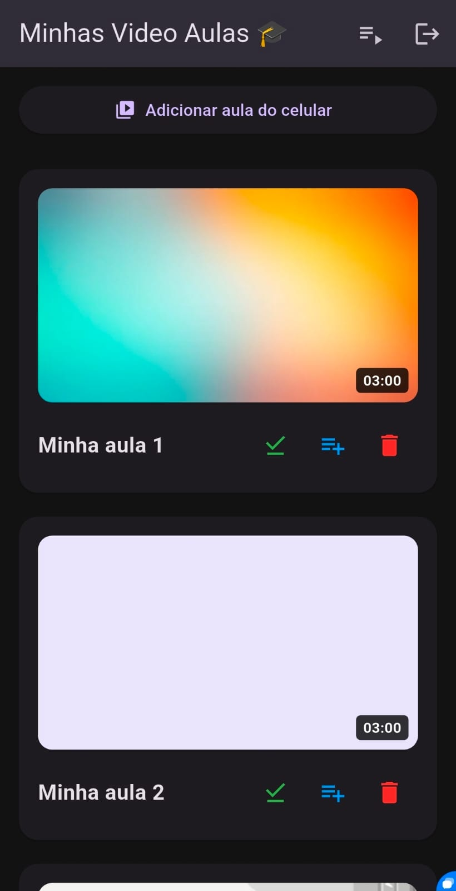

# 🎓 Video Aulas App — Flutter + Firebase

Aplicativo mobile desenvolvido em **Flutter** para assistir videoaulas e continuar exatamente de onde parou, com sincronização em nuvem ☁️.

O app funciona como um **mini YouTube de aulas**, com suporte a vídeos locais, download offline e sistema completo de playlists.

---

# 🎬 Demonstração do App

  

---

# 📱 Screenshots

  
  

  
  

  
  

---

# 🚀 Funcionalidades

### 🔐 Autenticação
- Login e cadastro com **Firebase Authentication**

### ☁️ Sincronização em Nuvem
- Progresso salvo no **Cloud Firestore**
- Continuar vídeo exatamente de onde parou
- Sincronização entre dispositivos

### 🎬 Player estilo YouTube
- Controles que desaparecem automaticamente  
- Tempo restante do vídeo  
- Barra de progresso arrastável  
- Tela cheia com rotação automática  

### 📥 Modo Offline
- Download de vídeos para assistir offline  
- Adicionar vídeos direto do celular  
- Geração automática de thumbnails (estilo YouTube)  
- Vídeos locais persistentes  

### 📚 Sistema de Playlists
- Criar playlist  
- Adicionar vídeos à playlist  
- Remover vídeos da playlist  
- Deletar playlist  

### 🔋 Experiência do usuário
- Tela não desliga durante reprodução (Wakelock)

---

# 🧠 Tecnologias utilizadas

- Flutter  
- Firebase Authentication  
- Cloud Firestore  
- Video Player  
- Shared Preferences  
- File Picker  
- Video Thumbnail  
- Path Provider  
- Wakelock Plus  

---

# 📦 APK para teste

---

# 📦 Baixar APK para teste

Você pode baixar e testar o aplicativo Android clicando abaixo:

  

👉 Caso o navegador bloqueie, permita o download e instale manualmente no celular.
